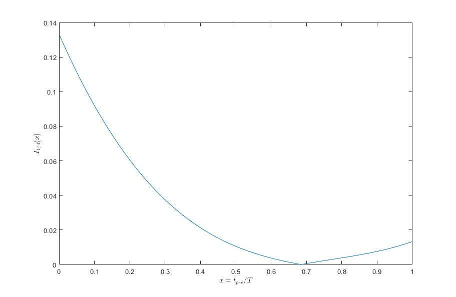
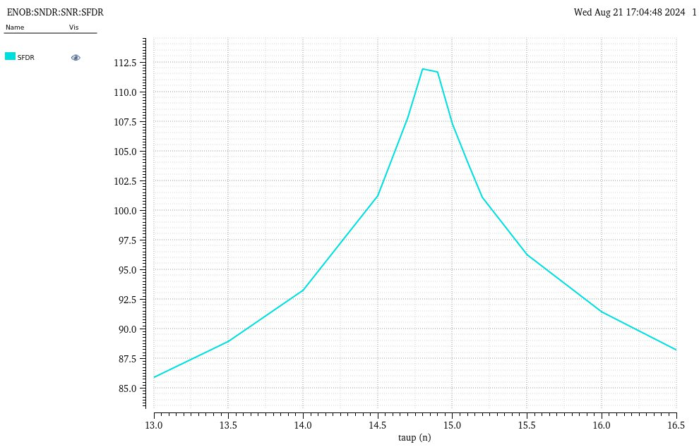
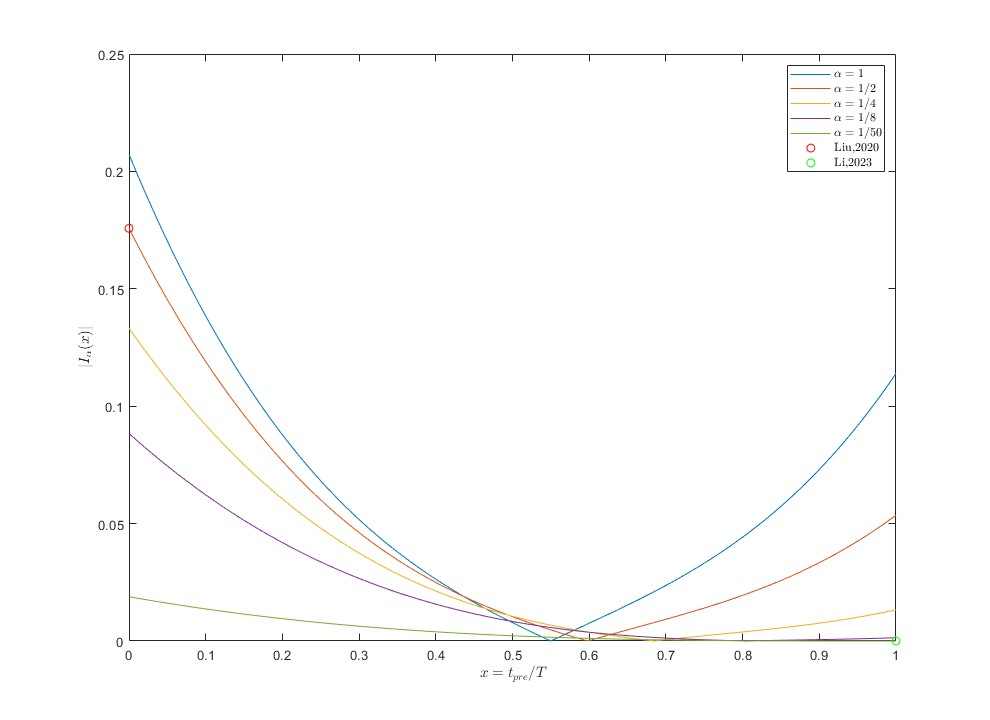
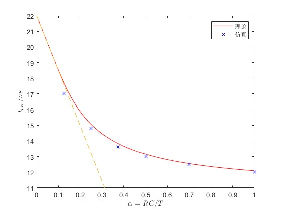
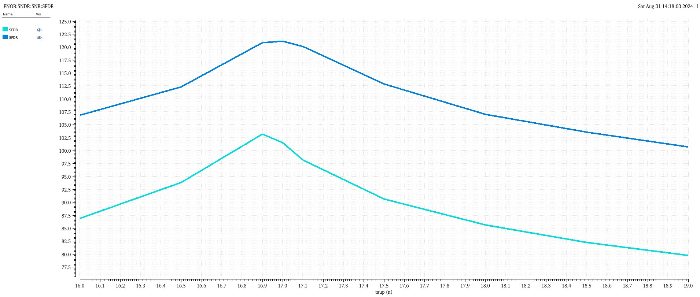

# Model
假设

1. 在采样的时间窗口内，输入信号可以在局部（对时间）线性化

   $$\left\{\begin{aligned}
        V_{sig}(t)&=\frac{\mathrm{d} V_{in}}{\mathrm{d} t}\Big|_{t=0}\cdot t\\
        V_{in}(t) &=\frac{\mathrm{d} V_{in}}{\mathrm{d} t}\Big|_{t=0}\cdot (t-t_{pre})
    \end{aligned}\right..$$

2. 系统非线性完全来自于放大器transfer curve的非线性，是无记忆的：

$$
V_{preamp}\left(V_{in}\right) = G_1\cdot V_{in} + \frac{1}{6}G_3\cdot V_{in}^3+\mathcal{O}(V_{in}^3).
$$

在采样时钟下降沿，采样电容上电压为

$$
    \tag{1}
    \begin{aligned}
        V_C 
        =& \frac{1}{RC}\int_0^T V_{preamp}(\tau)\exp\big(-(T-\tau)/RC\big)\mathrm{d}\tau\\
        =& \frac{1}{RC}\int_0^T \left(G_1 V_{in}(\tau)+\frac{1}{6}G_3V_{in}^3(\tau)\right)\exp\big(-(T-\tau)/RC\big)\mathrm{d}\tau\\
        =& \underset{\text{线性项}}{\underbrace{\frac{1}{RC}\int_0^T G_1V_{in}(\tau)\exp\big(-(T-\tau)/RC\big)\mathrm{d}\tau}}\\
        &+
        \underset{\text{非线性项}}{\underbrace{\frac{1}{RC}\int_0^T \frac{1}{6}G_3\left(\frac{\mathrm{d} V_{in}}{\mathrm{d} t}\Big|_{t=0}\right)^3(\tau-t_{pre})^3\exp\big(-(T-\tau)/RC\big)\mathrm{d}\tau}}\\
        =& V_{lin} + V_{non-lin}
    \end{aligned}
$$

不妨假设$G_3\frac{\mathrm{d} V_{in}}{\mathrm{d} t}\Big|_{t=0}>0$，那么$t_{pre}=0$时上面最后一个积分内恒正；$t_{pre}=T$时，上面最后一个积分内恒负.

$\Rightarrow$存在最优的$t_{pre}$取值使得$V_{non-lin}$幅度为0.

求解上面的积分：

$$
    \tag{2}
    \begin{aligned}
    V_{non-lin} 
    &:= \int_0^T \frac{1}{6}G_3\left(\frac{\mathrm{d} V_{in}}{\mathrm{d} t}\Big|_{t=0}\right)^3(\tau-t_{pre})^3\exp\big(-(T-\tau)/RC\big)\mathrm{d}\tau\\
    &=\frac{1}{6}G_3\left(T\cdot\frac{\mathrm{d} V_{in}}{\mathrm{d} t}\Big|_{t=0}\right)^3 I_{\alpha}(x)
    \end{aligned}
$$

其中$\alpha=RC/T$，$x=t_{pre}/T$，

$$I_{\alpha}(x)= \exp(-1/\alpha)(6\alpha^3+6\alpha^2 x+3\alpha x^2+x^3)-\left(6\alpha^3+6\alpha^2(x-1)+3\alpha(1-x^2)+(x-1)^3\right).$$

以$\alpha=1/4$为例，$|I_\alpha(x)|$曲线如下.

$I_\alpha(x)$的零点为$x=0.6848$.

在实际仿真中，取采样时间窗口$T=22ns$，RC时间常数为$RC=T/4=5.5ns$，对应$\alpha=1/4$。仿真SFDR随$t_{pre}$变化趋势如下图.

可见在$t_{pre}\sim14.8ns$时SFDR达到峰值，对应$t_{pre}/T=14.8ns$.而根据$I_\alpha(x)$的零点，理论推测SFDR最优值应当在$t_{pre}=0.6848T=15ns$处取到，与实际仿真结果吻合.

# Remarks
**对预测时间的敏感性**

来源于非线性抵消而非抑制

**采样带宽（RC常数）的影响**

不同$\alpha=RC/T$取值下的$|I_\alpha(x)|$曲线如下图.

不同$\alpha=RC/T$取值下的理论最优预测时间与仿真最优预测时间曲线如下图.

**输入信号频率的影响**

- 影响(2)式中$\left(T\cdot\frac{\mathrm{d}V_{in}}{\mathrm{d} t}\Big|_{t=0}\right)^3$一项进而影响SFDR，3阶
- 不影响最优$t_{pre}$的位置

**放大器线性度的影响**

- 不影响$I_\alpha(x)$ $\Rightarrow$ 不影响技术的本质
- 通过(2)式中的$G_3$进而影响SFDR

    电路级别的调整（调整VDD、gmoverid）对$G_3$的优化较为有限，$G_3$对$V_{non-lin}$的影响的阶数不超过线性
    
    $\Rightarrow$ 放大器优化对SFDR提升效果不如其他层面的优化显著

**非理想的预测的影响**

预测器的噪声与失真无法被cancel，会泄露到采样电容上.设计复杂度实际上转移到预测器上

# To be explained/supplemented
- 虽然做了假设二，但是理论上放大器Cgg带来的非线性注入的位置和transfer curve带来的非线性注入的位置是一样的，理论上也可以被处理
- 在最优$t_{pre}$处，SFDR被什么限制？

- 预测峰值SFDR

